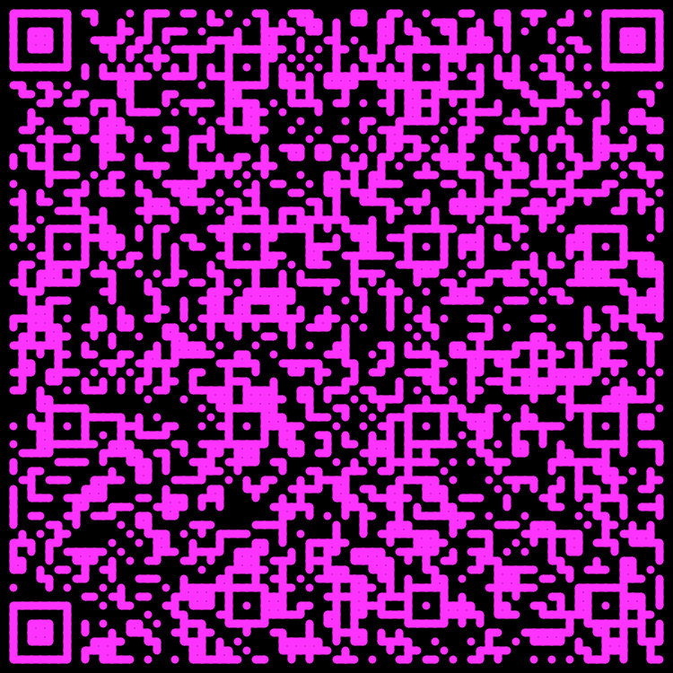

# QRage Pro

> The No-BS QR code generator. Generate QR codes for links, emails, WiFis,
> calendars, VCards, and business cards and more. 100% customizable, 0% cost.

QRage Pro (pron. *Courage Pro*) is a professional QR code generator for
everybody. It generates QR codes from many pieces of data relevant to
individuals and companies alike. Moreso, it offers all necessary features to
fully customise your QR codes and adapt them to your brand with custom colors,
logos, and shapes.

All free features at a glance:

* Encode URLs, phone numbers, emails, WiFi credentials, business cards, calendar
  events, and much more
* Custom colors: Choose from a set of sensible defaults, or apply your own brand
  color
* Different aesthetic styles: Choose between the default block shape, dots, and
  a fluid Rorschach blot appearance
* Make your QR code a brand ambassador: Emboss your company's logo onto the
  QR code to strengthen your brand

Start creating your QR codes today with QRage Pro!

> [!TIP]
> [Click here](#usage) to jump directly to the usage instructions.

## Examples

Here are some examples created with QRage Pro. Try them out by pointing your
smartphone's camera at the QR codes and scan them!

A small URL QR code with custom color and logo.

A medium URL QR code with dot matrix, custom color and logo.

A large URL QR code using the Rorschach blot style, custom color, and logo.

A large VCard QR code using the Rorschach blot style, custom foreground and background color.

## Usage

QRage Pro is implemented as a progressive web app on top of modern web
technologies. It runs in any modern browser, including Chrome, Safari, or
Firefox. To get started, simply start the app, choose the type of QR code you
want to create, and enter the appropriate data. Depending on what type of data
you encode into the QR code, smartphones will offer various actions:

* open URLs in the web browser
* add VCards to the address book
* add events to the calendar
* connect to a network using the provided WiFi credentials

After you have decided upon and entered the necessary data, click on the
settings tab to begin customizing your QR code. Here you have a variety of
choices:

* **Style**: Select the general appearance of the QR code: Squares will create a
  standard QR code, dots will create a more subtle appearance, and Rorschach
  blot will create a dynamic and fluid code.
* **Error correction**: You can safely keep this at the default (medium), but if
  your QR code will be scanned from further away, or you want your logo to
  appear larger, you may need to increase this setting.
* **Size**: How large the QR code will be. This setting determines the size of
  an individual block in pixels
* **Margin**: The margin around the QR code, which makes it easier for scanners
  to decode the information. You can remove it entirely, if you like to.
* **Logo**: Upload your custom logo here. Ensure that it has a sufficient size
  so that it does not look blurry.
* **Logo size**: How large the logo will appear. The larger, the more difficult
  it will be for scanners to decode the QR code.
* **Foreground color**: Select the QR code's color (default: black). Ensure this
  has an appropriate contrast to the background color.
* **Background color**: Select a background color (default: white). The first
  color is transparent. Ensure it has an adequate contrast with the foreground
  color.

After you are done, you can export the QR code to your computer.

> [!TIP]
> Always test out your QR codes with your own smartphone to see if they work. If
> your smartphone doesn't detect the code, you may have to change the colors,
> shape, error correction level, or logo size.

## Contributing

PRs to add functionality and fix bugs are highly appreciated.

## License

This software is licensed via the [GNU GPL v3-License](https://www.gnu.org/licenses/gpl-3.0.en.html).
